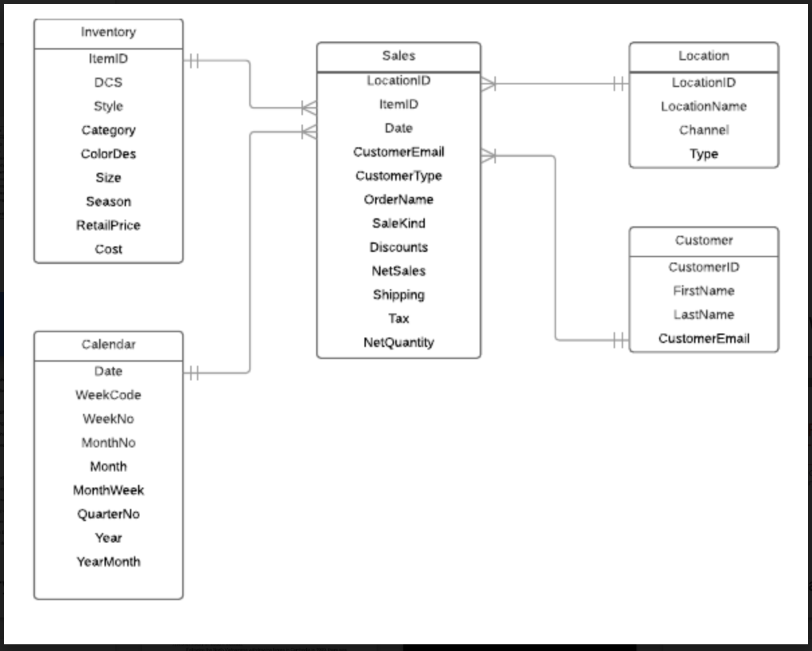

# ONS Database Project
By: Anthony Chung, Moses Pallapati, Hannah Sawyer

# Table of Content
1) Datasource

2) ERD

3) DDL

4) DML

5) Retail Analysis

6) Add in more data through external source

## Datasource
The datasource we are using is from the clothing company ONS. We are using a limited amount of the data to do some simple analysis that can provice us with a snapshot on how the company is doing between September 2017 - December 2017
<u>DataFiles :<u/>

1) Calendat2017.csv

2) Contacts.csv

3) Inventory.csv

4) Location.csv

5) Sales.csv

6) NewSales.csv

## ERD

## DDL

Link:[https://github.com/fairfield-university-is510-fall2017/final-project-3-blind-mice/blob/master/DDL.ipynb]

## DML

Link:[https://github.com/fairfield-university-is510-fall2017/final-project-3-blind-mice/blob/master/DML.ipynb]

## Retail Analysis

Link:[https://github.com/fairfield-university-is510-fall2017/final-project-3-blind-mice/blob/master/Retail%20Analysis.ipynb]

## Adding in more data

Link:[https://github.com/fairfield-university-is510-fall2017/final-project-3-blind-mice/blob/master/NewSales.csv]

## Lesson Learned/ Challenges

<u>*Challenges*</u>

Spent alot of time recreating the ERD to fit most of the useable data columns

Shopify API: Was able to get it work in PowerBI but could not connect the actual path to ons.db in python script 

<u>*Lesson Learned*</u>

Using sqlite to create a small compress database as a flat file that can be shared

Converting files from excel to csv to sql_table

be able to run sql anywhere even without a sql extension software like my sql workbench

